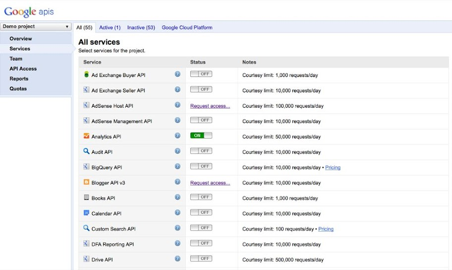
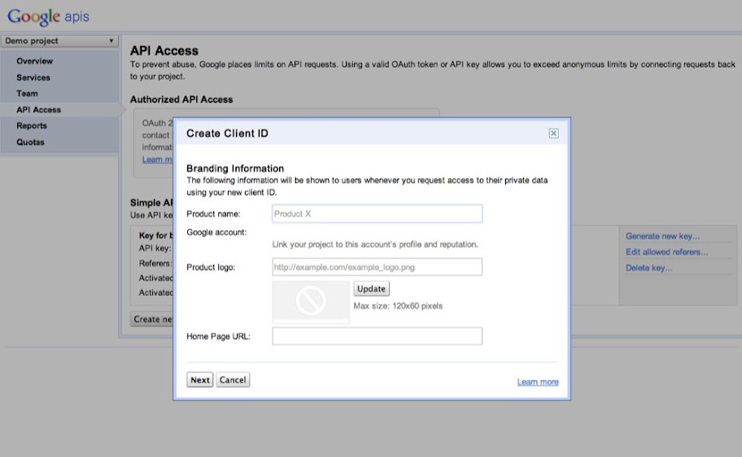
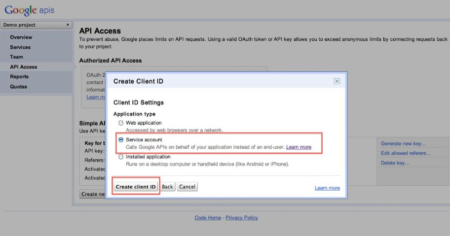
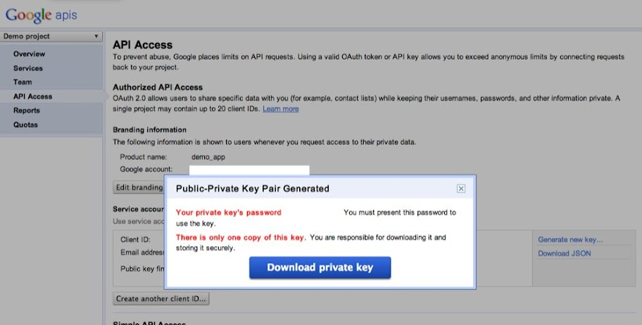
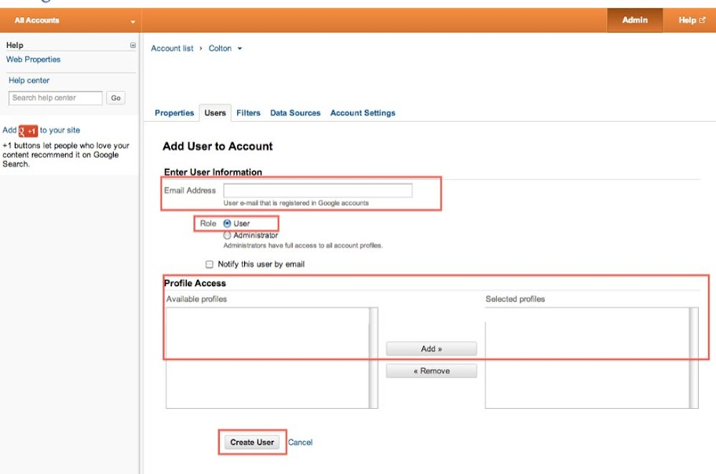

I didn't have a great time trying to implement a *simple* feature involving Google Analytics in one of my projects (nodejs web application).  

My humble requirement was to collect some data (events) I was pushing to Google Analytics in order to create a simple report for my users.
Since it isn't a critical report, my idea was to get the data once a day and cache it.  

So, as simple as it seems, it has been a tough trip for me and I want to share the whole process with the community. I hope anyone trying to achive something similar gets to this article and find it helpful.

These are the main steps I had to take:

* Register an application in [Google API console center](https://code.google.com/apis/console)
* Create a service account
* Register the newly created service account generated email into the Google Analytics account I wanted to consume
* Implement the authorization token request (create a _JWT_)
* Implement the request to collect data from Google Analytics

<!-- more -->

## Registering an application in Google API console center

First of all you need to sign in into [Google API console center](https://code.google.com/apis/console) and register a new project. Once you create it (you just need to fill the project name), you should select the _Services_ link in the left vertical menu. Here you can set what Google services your project will need access to. So we click on the _Analytics API_ switch button to activate this permission.



## Create a service account

Next we need to create the service account.  
In the left vertical menu you should click in the *API Access* link. You should see a big blue button saying *Create an OAuth Client ID...*. 


Click there and you will be presented a popup to fill some info about the app that will be using the Google service. Fill the project name at least.



Now you will get to a second step (inside the popup) where you need to choose you want to create a *service account*.




After you click in *Create client ID* button, the popup will show a message stating that public-private key pair has been generated. You will get a password and your private key (the password is for working with the private key).  
Save the private key file ('.p12' file type) into your hard drive.



When you close the popup you will see a new section in the main page (*Service account*). You need to take not about the *Email address* generated for the service account.


There's one important last step you need to take here. Google has given you a private key in a '.p12' file, but you will need a *.pem* file in order to sign your JWT.  
In order to achieve this step you need to have *openssl* tool installed in your system.  
Open a terminal and browse to the folder where you saved the private key. Then type this command:

```
my_computer$ openssl pkcs12 -in YOUR_PRIVATE_KEY_FILE.p12 -out demo_certificate.pem -nodes
```

After that, you will have a new file in your folder called *certificate.pem*. This is the one we will use later on.

## Register service account in Google Analytics

In this step you need to grant read access to the brand new service account in your Google analytics project.  
Log in to [Google Analytics](http://www.google.com/analytics/) and navigate to your project. Enter de *Admin* section and look for the *Users* tab.


Click in the *New User* button and type the email for the service account you previously created. Use the *User* role.  
In the *profile* section, select your Analytics project profile and add it to *Selected profiles* panel.  
Finally, push *Create user button*.



That's it!

## Implement authorization request

In order to access *Analytics* data, we need to get an authorization token first. We will use the email of the brand new service account created and also the private key (*.pem* file) to generate a *JWT* (JSON Web Token). We will send a *POST* request to Google with this JWT so they answer with an access token.

Here is my version of the code implementing JWT generation and request:

```javascript
var fs = require('fs'),
    crypto = require('crypto'),
	request = require('request'); // This is an external module (https://github.com/mikeal/request)
	
var authHeader = {
			'alg': 'RS256',
		'typ': 'JWT'
	},
	authClaimSet = {
			'iss': process.env.GA_SERVICE_ACCOUNT, // Service account email
		'scope': 'https://www.googleapis.com/auth/analytics.readonly', // We MUST tell them we just want to read data
		'aud': 'https://accounts.google.com/o/oauth2/token'
	},
	SIGNATURE_ALGORITHM = 'RSA-SHA256',
	SIGNATURE_ENCODE_METHOD = 'base64',
	GA_KEY_PATH = 'PATH_TO_YOUR_PRIVATE_KEY.pem',
	gaKey;

function urlEscape(source) {
		return source.replace(/\\+/g, '-').replace(/\\//g, '_').replace(/\\=+$/, '');
}

function base64Encode(obj) {
		var encoded = new Buffer(JSON.stringify(obj), 'utf8').toString('base64');
	return urlEscape(encoded);
}

function readPrivateKey() {
		if (!gaKey) {
			gaKey = fs.readFileSync(GA_KEY_PATH, 'utf8');
	}
	return gaKey;
}

var authorize = function(callback) {
	
	var self = this,
		now = parseInt(Date.now() / 1000, 10), // Google wants us to use seconds
		cipher,
		signatureInput,
		signatureKey = readPrivateKey(),
		signature,
		jwt;

	// Setup time values
	authClaimSet.iat = now;
	authClaimSet.exp = now + 60; // Token valid for one minute

	// Setup JWT source
	signatureInput = base64Encode(authHeader) + '.' + base64Encode(authClaimSet);

	// Generate JWT
	cipher = crypto.createSign('RSA-SHA256');
	cipher.update(signatureInput);
	signature = cipher.sign(signatureKey, 'base64');
	jwt = signatureInput + '.' + urlEscape(signature);
	
	// Send request to authorize this application
	request({
			method: 'POST',
		headers: {
				'Content-Type': 'application/x-www-form-urlencoded'
		},
		uri: 'https://accounts.google.com/o/oauth2/token',
		body: 'grant_type=' + escape('urn:ietf:params:oauth:grant-type:jwt-bearer') +
			'&assertion=' + jwt
	}, function(error, response, body) {
			if (error) {
				console.log(error);
			callback(new Error(error));
		} else {
				var gaResult = JSON.parse(body);
			if (gaResult.error) {
					callback(new Error(gaResult.error));
			} else {
					callback(null, gaResult.access_token);
			}
		}
	});

};
```

The auth request must have two parameters:

* grant_type: This is a constant
* assertion: Generated JWT

As you can see, JWT is created with three parts:

* a fixed header
* a claim set: info about what are what do we need the access token for
* a signature (generated based on the other two)

The *scope* property of the *claim set* must be set to *readonly*. At least, I couldn't get it work without it, even if I set the service account with an administrator role in my *Analytics* project settings.

The response from *Google* should be something like this:
```javascript
{
	"access_token" : "1/8xbJqaOZXSUZbHLl5EOtu1pxz3fmmetKx9W8CV4t79M",
	"token_type": "Bearer",
	"expires_in": 3600
}
```

## Implement analytics data request

The hard part is already done, this is the easy one.  
Now we only need to make a request to *Google Analytics* service using our auth token.

```javascript
var request = require('request'),
	qs = require('querystring');
	
authorize(function(err, token) {
	if (!err) {
		// Query the number of total visits for a month
		var requestConfig = {
				'ids': 'ga:YOUR_ANALYTICS_PROJECT_PROFILE_ID',
			'start-date': '2012-12-01',
			'end-date': '2012-12-21',
			'dimensions': 'ga:visitors'
			'max-results': '10'
		};
		
		request({
				method: 'GET',
			headers: {
					'Authorization': 'Bearer ' + token // Here is where we use the auth token
			},
			uri: 'https://www.googleapis.com/analytics/v3/data/ga?' + qs.stringify(requestConfig)
		}, function(error, resp, body) {
				var data = JSON.parse(body);
			console.log(data);
		});
	}
});
```


## References:

* [Using OAuth 2.0 for Server to Server Applications](https://developers.google.com/accounts/docs/OAuth2ServiceAccount)
* [Google Analytics Core Reporting API - Reference Guide](https://developers.google.com/analytics/devguides/reporting/core/v3/reference)
* [Google Analytics Query Explorer 2](http://ga-dev-tools.appspot.com/explorer/)
* [node-green-jwt](https://github.com/berngp/node-green-jwt)
* [node-googleanalytics](https://github.com/ncb000gt/node-googleanalytics)
* [Stack Overflow 1](http://stackoverflow.com/questions/9863509/service-applications-and-google-analytics-api-v3-server-to-server-oauth2-authen)
* [Stack Overflow 2](http://stackoverflow.com/questions/11529595/is-a-service-account-the-right-credentials-for-querying-google-bigquery-in-node)
