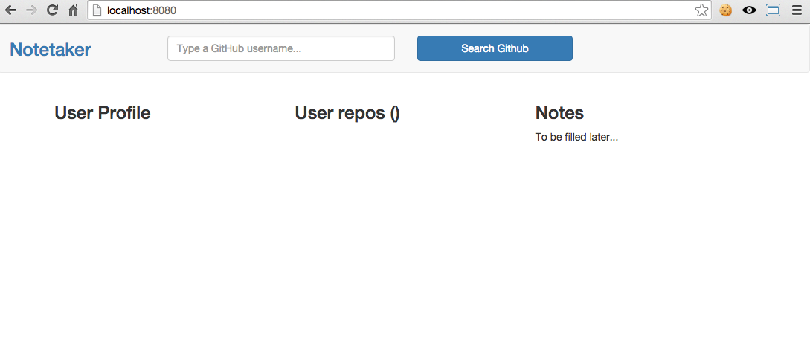
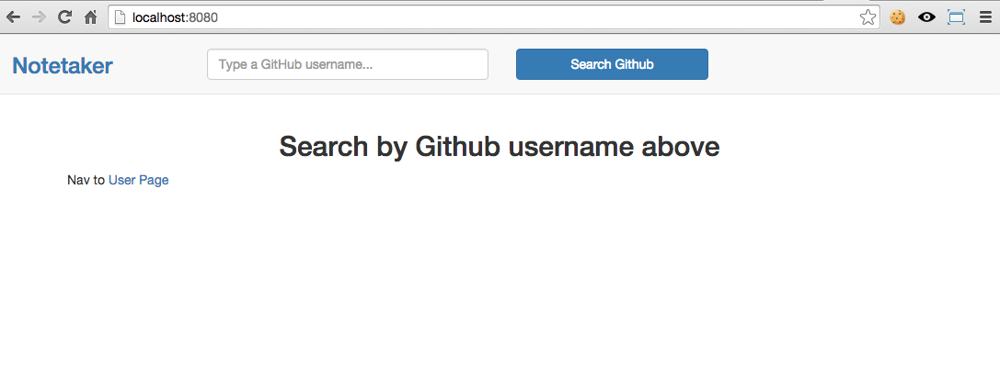

(_Previous step_: [Creating the barebones](/post/ractive-js-tutorial-creating-the-barebones))

_Ractive_ does not have its own [routing system](http://docs.ractivejs.org/latest/routing) becouse it is a library, not a framework, and routing is not part of its goal.
In the link above you can see they recommend:

- [Backbone.Router](http://backbonejs.org/#Router)
- [PageJS](https://visionmedia.github.io/page.js/)

There is also a Ractive specific router built by Martin Kolarik you can check:

- [Ractive-route](https://github.com/MartinKolarik/ractive-route)

As I already have some experience with _PageJS_ I will be using that library for implementing a custom made routing subsystem.

<!-- more -->

## User page

Right now we only have implemented our _home_ page so let's begin by creating our _user_ page.
This page will have three sections: Github user profile, Github user repos and our persisted notes about the user.
Let's create the sections and then, the page which uses them.

**_root-folder_/app/views/user/profile-section.html**
```html
<div>
	<h3> User Profile </h3>
	<ul class="list-group">
		{{#profile.avatar_url}}<li class="list-group-item"> </li>{{/profile.avatar_url}}
		{{#profile.name}}<li class="list-group-item">Name: {{profile.name}}</li>{{/profile.name}}
		{{#profile.login}}<li class="list-group-item">Username: {{profile.login}}</li>{{/profile.login}}
		{{#profile.email}}<li class="list-group-item">Email: {{profile.email}}</li>{{/profile.email}}
		{{#profile.location}}<li class="list-group-item">Location: {{profile.location}}</li>{{/profile.location}}
		{{#profile.company}}<li class="list-group-item">Company: {{profile.company}}</li>{{/profile.company}}
		{{#profile.followers}}<li class="list-group-item">Followers: {{profile.followers}}</li>{{/profile.followers}}
		{{#profile.following}}<li class="list-group-item">Following: {{profile.following}}</li>{{/profile.following}}
		{{#profile.public_repos}}<li class="list-group-item">Public Repos: {{profile.public_repos}}</li>{{/profile.public_repos}}
		{{#profile.blog}}<li class="list-group-item">Blog: <a href="{{profile.blog}}" target="_blank">{{profile.blog}}</a></li>{{/profile.blog}}
	</ul>
</div>
```
**_root-folder_/app/js/components/user/profile-section.js**
```language-javascript
import Ractive from 'ractive';
import Template from '../../../views/user/profile-section.html';

var UserProfileSection = Ractive.extend({
		isolated: true,
	template: Template
});

export default UserProfileSection;
```
---
**_root-folder_/app/views/user/repos-section.html**
```html
<div>
	<h3>User repos ({{repos.length}})</h3>
	<ul class="list-group">
		{{#each repos}}
			<li class="list-group-item">
				{{#html_url}}
					<h4><a href="{{html_url}}" target="_blank">{{name}}</a></h4>
				{{/html_url}}
				{{#description}}
					<p>{{description}}</p>
				{{/description}}
			</li>
		{{/each}}
	</ul>
</div>
```

**_root-folder_/app/js/components/user/repos-section.js**
```language-javascript
import Ractive from 'ractive';
import Template from '../../../views/user/repos-section.html';

var ReposSection = Ractive.extend({
		isolated: true,
	template: Template
	// If we declare here data with attributes provided from
	// the template, it stops working
	// This is the nearest issue I found: https://github.com/ractivejs/ractive/issues/1977
	/*,
	data: {
			repos: []
	}*/
});

export default ReposSection;
```

---

**_root-folder_/app/views/user/notes-section.html**
```html
<div>
	<h3> Notes </h3>
	<p>To be filled later...</p>
</div>
```

**_root-folder_/app/js/components/user/notes-section.js**
```language-javascript
'use strict';

import Ractive from 'ractive';
import Template from '../../../views/user/notes-section.html';

var NotesSection = Ractive.extend({
		isolated: true,
	template: Template
});

export default NotesSection;
```

---
Finally, our _user_ page which uses previous sections:
**_root-folder_/app/views/user-page.html**
```html
<div class="row">
	<div class="col-md-4">
		<UserProfile />
	</div>
	<div class="col-md-4">
		<Repos />
	</div>
	<div class="col-md-4">
		<Notes />
	</div>
</div>
```

**_root-folder_/app/js/components/user-page.js**
```language-javascript
import Ractive from 'ractive';
import Template from '../../views/user-page.html';
import UserProfile from './user/profile-section';
import Repos from './user/repos-section';
import Notes from './user/notes-section';

var UserPage = Ractive.extend({
		template: Template,
	components: {
			UserProfile: UserProfile,
		Repos: Repos,
		Notes: Notes
	}
});

export default UserPage;
```

Now, to check that everything is ok, we can update the _App_ to render this page instead of the home page.

Modify these files like this:
**_root-folder_/app/js/app.js** (import and declare the new user page component):
```language-javascript
import Ractive from 'ractive';
import template from '../views/app.html';
import SearchUserComponent from './components/layout/search-user';
import HomePageComponent from './components/home-page';
import UserPageComponent from './components/user-page'

let App = new Ractive({
	  el: '#app',
  template: template,
  components: {
	  	SearchUser: SearchUserComponent,
  	HomePage: HomePageComponent,
  	UserPage: UserPageComponent
  }
});

export default App;
```

**_root-folder_/app/views/app.html** (change the main section)
```html
<div class="main-container">
	<nav class="navbar navbar-default" role="navigation">
		<div class="col-sm-1">
			<a href="/">
				<h3>Notetaker</h3>
			</a>
		</div>
		<div class="col-sm-7 col-sm-offset-1" style="margin-top: 15px;">
			<SearchUser placeholder="Type a GitHub username..." />
		</div>
	</nav>
	<div class="container">
		<UserPage />
	</div>
</div>
```

If you load the appliction right now, you should see something like this:


## Router component

Great, let's talk about routing...
Right now, in our application template we're telling which page to use with this section:
```html
<div class="container">
  <UserPage/>
</div>
```
We want to use a custom component that uses the page component corresponding to the current route.
We will be creating a _Route_ component which accepts an attribute indicating which page component it should render.
**_root-folder_/app/js/component/layout/router.js**
```language-javascript
import Ractive from 'ractive';

/*
	This router has been built on top of the ideas from this Stack Overflow question:
	http://stackoverflow.com/questions/31075341/how-to-create-ractives-subcomponents-dynamically-and-change-them-programmatical
*/

var Router = Ractive.extend({
		template: '<router-handler/>',
	components: {
			'router-handler': function() {
				return this.get('componentName');
		}
	},
	oninit: function() {
			this.observe('componentName', function(newValue, oldValue) {
				if (this.fragment.rendered) {
					this.reset();
			}
		});
	}
});

export default Router;
```
There are a lot of things happening here:

1. The template is very basic as it just needs what page component to use. We define a _route-handler_ inner component which is linked in the second step.
2. We define the inner component so that instead of being a component class, it is a function that returns the page component it should use. The page component will be a router data attribute which will be updated from the _App_. Take note that we don't define this component as isolated as we want it to be aware of the page component it should render, which will be handled from the _App_ instance.
3. When this _router_ component is initialized, it registers a listener on the _componentName_ data attribute from its context (which inherits from its parent, _App_ instance) so that, every time it gets updated, this component calls its **reset** function, which causes it to re-render, using the new page component set in the _componentName_ attribute.
4. We have a conditional statement so we don't do this if the component has not been already rendered for the first time (bootstraping).

Now we need to update our _App_ instance so it makes use of this new component, instead of setting in its template which page component to use.
**_root-folder_/app/views/app.html**
```html
<div class="main-container">
	<nav class="navbar navbar-default" role="navigation">
		<div class="col-sm-1">
			<a href="/">
				<h3>Notetaker</h3>
			</a>
		</div>
		<div class="col-sm-7 col-sm-offset-1" style="margin-top: 15px;">
			<SearchUser placeholder="Type a GitHub username..." />
		</div>
	</nav>
	<div class="container">
		<Router componentName="{{componentName}}"/>
	</div>
</div>
```
Take note about the attribute we're passing to Router component from the markup.

We also need to update the _App_ to create the _componentName_ property so we can handle there the value for the page we must show.
```language-javascript
import Ractive from 'ractive';
import template from '../views/app.html';
import SearchUserComponent from './components/layout/search-user';
import HomePageComponent from './components/home-page';
import UserPageComponent from './components/user-page'

let App = new Ractive({
	  el: '#app',
  template: template,
  components: {
	  	SearchUser: SearchUserComponent,
  	HomePage: HomePageComponent,
  	UserPage: UserPageComponent
  },
  data: {
	  	componentName: 'HomePage'
  }
});

export default App;
```

Now, if you reload your browser, you should see the _home_ page again, and, if you change the _componentName_ data attribute from _HomePage_ to _UserPage_ and reload your browser again, you should see the user page instead.

Ok, so now we have the ability to show different pages from the _App_, but how do we link this to URL changes and how do we navigate from one to another?
This is when we begin using [PageJS](https://visionmedia.github.io/page.js/). Like every other routing library, it allows us to be notified when the URL changes, it can force URL changes and it also allows to handle redirects.

Take a moment to install the library in our project:
```
$ npm install page --save
```

We will create our own library module on top of _PageJS_ which will be initialized from our _App_ instance, getting passed the routing configuration, so it knows which function is has to invoke for every registerd route.

Let's begin by defining routing configuration module:
**_root-folder_/app/js/config/routes.js**
```language-javascript
'use strict';

import router from '../plugins/router';
import HomePage from '../components/home-page';
import UserPage from '../components/user-page';

var routes = new Map();

routes.set('/', (context, next) => {
		next(null, HomePage);
});

routes.set('/user/:username', (context, next) => {
		next(null, UserPage);
});

export default routes;
```

Now, the router module:
**_root-folder_/app/js/plugins/router.js**
```language-javascript
import page from 'page';
import Ractive from 'ractive';

function navigationHandler(routeHandler, onNavigation) {
		return function(context/*, next*/) {
			routeHandler(context, (error, PageComponent = {}, data = {}) => {
				context.pageName = PageComponent._name;
			context.state = data;
			onNavigation(error, context);
		})
	};
}

export function init(routes, onNavigation) {
	
	routes.forEach((routeHandler, path) => {
			page(path, navigationHandler(routeHandler, onNavigation));
	});

	page({
			hashbang: true
	});
}

export function navTo(url) {
		page.show(url);
}
```

The _init_ function gets the configuration map and a callback as parameters. The second one will be invoked after the router handler gets executed with a _context_ object containing routing information and the data passed from the route handler function (defined in the _routes.js_ filed).
The last line in this file initializes _PageJS_ so, by default, it intercepts all links and checks if we have a handler configured for them.
We also pass the configuration _hashbang: true_ so we don't use HTML5 _pushState_ and use the URL hash fragment instead, as we won't be using a server and the application would fail if we try to load an URL like this: http://localhost:8080/user/paquitosoft.

This file also has a _navTo_ function so we can programatically navigate to any route. We will use it from our _SearchUser_ component.

Ok, lets update our _App_ instance to deal with routing with all we have done until now:
**_root-folder_/app/js/app.js**
```language-javascript
import Ractive from 'ractive';
import template from '../views/app.html';

import * as RouterPlugin from './plugins/router';
import routesConfiguration from './config/routes';

import RouterComponent from './components/layout/router';
import SearchUserComponent from './components/layout/search-user';
import HomePageComponent from './components/home-page';
import UserPageComponent from './components/user-page'

let App = new Ractive({
		el: '#app',
	template: template,
	components: {
			SearchUser: SearchUserComponent,
		Router: RouterComponent,
		HomePage: HomePageComponent,
		UserPage: UserPageComponent
	},
	data: {
			componentName: 'HomePage'
	},
	oninit() {
			RouterPlugin.init(routesConfiguration, this.onNavigation.bind(this));
		console.log('App::oninit# Application initialized!');
	},
	onNavigation(error, navigationContext) {
			console.log('APP::onNavigation# Navigating to:', navigationContext.pageName, 'with context:', navigationContext);

		if (error) {
				console.warn('App::onNavigation# Error navigating:', error);
		} else {
				this.set({
					req: {
						params: navigationContext.params,
					body: navigationContext.state
				},
				componentName: navigationContext.pageName
			});
		}
	}
});

export default App;
```

Now, when the _App_ is initialized, it configures the route module passing the routes configuration and a callback function.
When the callback gets called, we update the data context setting the _componentName_ attribute to the name of the page component we need to show. The value gets to this function in the _navigationContext_ parameter which gets passed from the router plugin, which gets it from the routes configuration the _App_ passed upon initialization.

The last touch is to update the home page so we can test our navigation:
**_root-folder_/app/views/app.html**
```html
<h2 class="text-center">
	Search by Github username above
</h2>
<p>
	Nav to <a href="/user/paquitosoft">User Page</a>
</p>
```

Now, if you load the home page on your browser (http://localhost:8080/), you should see this:


You can follow the lower-left link to load the user page and use the upper-left (_Notetaker_) title link to get back to the home page.
(_Remember to remove the lower-left link once you're done with your tests).

---

You can check the source code in [this GitHub repo](https://github.com/PaquitoSoft/notetaker-ractive).

---

Previous post: [Creating the barebones](/post/ractive-js-tutorial-creating-the-barebones)
Next post: [Loading user info](/post/ractive-js-tutorial-loading-user-info)

---

