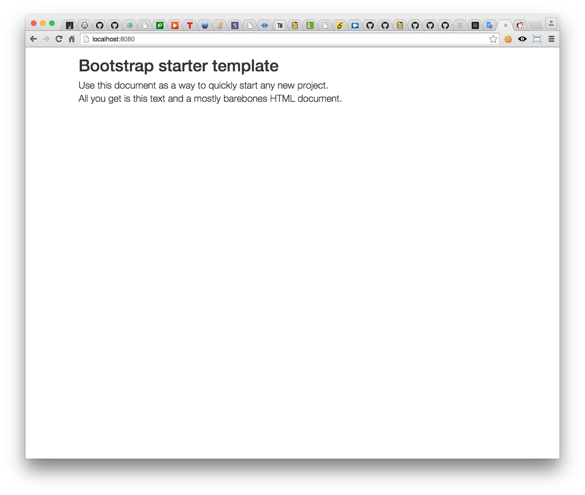

(_Previous step: [Tutorial introduction](/post/create-a-ractive-application-tutorial)_)

I'm glad you decided to get here and I hope I can get your attention all the way down to the end of this tutorial.

So, the first step is to set up your working environment with the tools you will use.
I assume you have [NodeJS](https://nodejs.org/download/) and NPM installed in your system. If not, please, follow the previous link and come back once you're ready.

Now, you need to create a new empty folder and initialize your project with _npm_:
```language
$ mkdir notetaker-ractive
$ cd notetaker-ractive
$ npm init
```
_NPM_ will ask you some questions. You don't need to type anything and just press _Enter_ for every question.
This command has created a new file (_package.json_) in your folder.
Now we need to install the basic packages:

- [Webpack](http://webpack.github.io/): will help us to bundle all our JS code and to use _ES2015_ import system.
- [Babel](https://babeljs.io/): will help us to use new _ES2015_ features by transpiling them to _ES5_ compatible code.
- [node-static](https://github.com/cloudhead/node-static): will serve our files (static server)

You can use this command:
```
$ npm i webpack babel-core babel-loader node-static --save-dev
```

**UPDATE (24-02-2016)**:
_The new version of Babel (v6) requires an extra dependency to be installed and configured. Please, if you're following this tutorial for the first time, also install **babel-preset-es2015** dependency_.

<!-- more -->

Let's start coding by creating our main _html_ file.
**_root-folder_/index.html**
```
<!DOCTYPE html>
<html>
	<head>
		<meta charset="UTF-8">
		<title>Ractive Github notetaker</title>
        <link rel="stylesheet" href="./node_modules/bootstrap/dist/css/bootstrap.css">	</head>
	<body>
<div class="container">
			<div class="starter-template">
				<h1>Bootstrap starter template</h1>
				<p class="lead">Use this document as a way to quickly start any new project.<br> All you get is this text and a mostly barebones HTML document.</p>
			</div>
		</div>
	</body>
</html>
```

In order to easily start a local server, we need to update our **package.json** file. Look for the _scripts_ attribute and replace the _test_ property with a _start_ one.
**_root-folder_/package.json**
```javascript
{
  "name": "notetaker-ractive",
  "version": "1.0",
  "description": "",
  "main": "index.js",
  "author": "Your name",
  "scripts": {
	    "start": "node node_modules/node-static/bin/cli.js"
  },
  "author": "Your name",
  "license": "ISC",
  "devDependencies": {
	    "babel-core": "^5.8.9",
    "babel-loader": "^5.3.2",
    "bootstrap": "^3.3.5",
    "node-static": "^0.7.7",
    "webpack": "^1.10.5"
  }
}
```
Now you only need to run this command from the root folder of your project everytime you want to start the server:

```
$ npm start
```
If you load this URL (http://localhost:8080/) in your browser, you should see the basic _html_ we've created.



The next step is to configure _webpack_ with the ability to _compile_ modern JS code.

We need to create a new _webpack_ configuration file and populate it with these contents: **_root-folder_/webpack.config.js**
```javascript
module.exports = {
		entry: './app/js/app.js',
	output: {
			filename: './dist/js/app-bundle.js'
	},
	module: {
			loaders: [
				{
					test: /\\.js$/,
				exclude: /(node_modules|bower_components)/,
				loader: 'babel',
                // If you're following the tutorial for the first time, 
                // you will be using Babel v6 and thus you need to add this extra configuration
                query: {
	                    presets: ['es2015']
                }
			}
		]
	}
};
```
We're telling _webpack_ that our main JS file is **./app/js/app.js**, that it should create only one bundle file with its contents (and all its dependencies) in **./dist/js/app-bundle.js** and that it should filter all files with a javascript extension (**.js**) with _babel_ loader, which will interpret _ES2015_ code and convert it to _ES5_ compatible.

Now let's create a basic _app.js_ file to test everything is working.
**_root-folder_/app/js/app.js**
```javascript
class Foo {
		constructor(name) {
			this.name = name;
	}

	sayHi() {
			alert(`Hi ${this.name}!!!`);
	}
}

let bar = new Foo('Paquitosoft');

bar.sayHi();
```
Just a simple code to demonstrate that _ES2015_ code is compiled by babel to produce _ES5_ compatible code.

Update the **index.html** file to load the bundle JS at the end of the _body_ tag:
```
<!DOCTYPE html>
<html>
	<head>
		<meta charset="UTF-8">
		<title>Ractive Github notetaker</title>
        <link rel="stylesheet" href="./node_modules/bootstrap/dist/css/bootstrap.css">	</head>
	<body>
<div class="container">
			<div class="starter-template">
				<h1>Bootstrap starter template</h1>
				<p class="lead">Use this document as a way to quickly start any new project.<br> All you get is this text and a mostly barebones HTML document.</p>
			</div>
		</div>

        <script src="dist/js/app-bundle.js"></script>
	</body>
</html>
```

The last step is to update our _npm start script_ to also use _webpack_ in monitoring mode so, everytime you update a file, it updates the generated bundle.
**_root-folder_/package.json**
```javascript
{
  "name": "notetaker-ractive",
  "version": "1.0",
  "description": "",
  "main": "index.js",
  "author": "Your name",
  "scripts": {
	    "start": "webpack -w & node_modules/node-static/bin/cli.js"
  },
  "author": "Your name",
  "license": "ISC",
  "devDependencies": {
	    "babel-core": "^5.8.9",
    "babel-loader": "^5.3.2",
    "bootstrap": "^3.3.5",
    "node-static": "^0.7.7",
    "webpack": "^1.10.5"
  }
}
```
Now, restart your local server (_Ctrl + C_ and _npm start_) and you should see something like this in your terminal:
```
$ npm start

> notetaker-ractive@1.0.0 start /Users/telemaco/Desarrollo/Node/Librerias/notetaker-ractive
> webpack -w & node_modules/node-static/bin/cli.js

serving "." at http://127.0.0.1:8080
Hash: 5fd031eb3af6c5d592e1
Version: webpack 1.10.5
Time: 748ms
                  Asset     Size  Chunks             Chunk Names
./dist/js/app-bundle.js  2.43 kB       0  [emitted]  main
    + 1 hidden modules
```

Reload your browser to check that everything is ok.
This is what you should see:


**Great!** you now have all you need to get into the interesting part of the tutorial.

---

You can check the source code in [this GitHub repo](https://github.com/PaquitoSoft/notetaker-ractive).

---

Previous step: [Introduction](/post/create-a-ractive-application-tutorial)
Next step: [Creating the barebones](/post/ractive-js-tutorial-creating-the-barebones)

---
